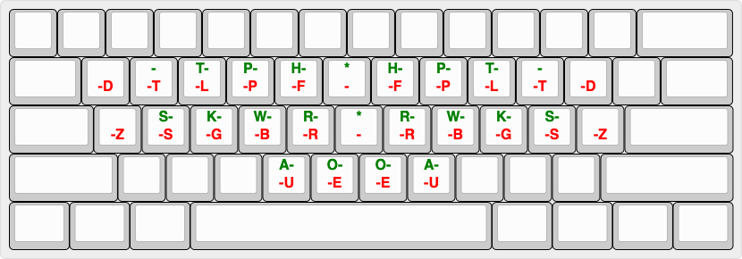

# plover-one-handed-lapwing

A [Plover](https://www.openstenoproject.org/plover/) plugin that allows for one-handed (either left or right hand) use of the [Lapwing](https://lapwing.aerick.ca/Home.html) theory/dictionaries.

Credit to Jennifer Chan for [plover-one-handed](https://github.com/jenchanws/plover-one-handed), which demonstrates how to intercept and pre-process keys (and transitively to Soffit and Kaoffie).

## Installation

1. Clone this repository:

```bash
$ git clone https://github.com/mickeyh/plover-one-handed-lapwing
```

2. Install this plugin from your local clone of this repository:

```bash
$ <path to Plover binary> -s plover_plugins install plover-one-handed-lapwing
```

3. Enable the `one_handed_lapwing` extension in the Configure > Plugins menu.

4. Switch to the `One-Handed Lapwing Stenotype` system.

## Layout

This plugin uses the same layout as Lapwing with minor modifications:

- The left hand shifted one key to the right.
- Left pinky `#` key is replaced by a special `-` key.
- Right hand `*` keys are replaced by a special `-` key.



To accommodate the alternation between left hand (first) and right hand (second) strokes, each hand's keys are mirrored onto the opposite hand. In the diagram above, the left (first) hand keys are indicated in green and the right (second) hand keys in red.

## Usage

This plugin translates two consecutive half strokes (corresponding to the keys for left and right hands respectively) into a single chord.

The first stroke is assumed to be the left hand portion and the second the right hand.

To indicate that there are no keys from a given hand in a chord, press the `-` key.

### Examples

We give some examples of chords and their corresponding left and right half strokes. Enter the left half stroke first and then the right.

| Chord | Left (First) Half Stroke | Right (Second) Half Stroke |
| --- | --- | --- |
| `TH` | `TH` | `-` |
| `PHR*UPB` | `PHR*` | `UPB` |
| `S` | `S` | `-` |
| `AEU` | `A` | `EU` |
| `WORBG` | `WO` | `RBG` |
| `TPH` | `TPH` | `-` |
| `PROG` | `PRO` | `G` |
| `P-P` | `P` | `P` |

## Caveats

- This plugin currently only works for the "Keyboard" device (if you'd like to extend to the [other devices supported by Lapwing](https://github.com/aerickt/plover-lapwing-aio/blob/c4077183722c59e6eee29854b3adc6bce4714a64/plover_lapwing/system.py#L9-L167) I'd accept clean PRs).
- I have little-to-no experience with or knowledge of stenography, so the approach of this plugin may have a lot of room for improvement.